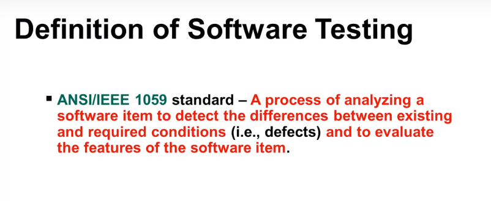
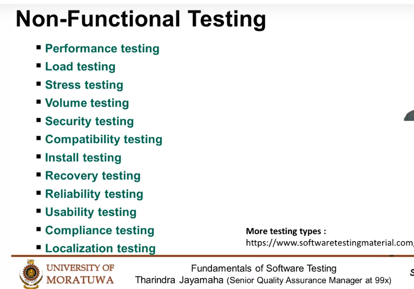
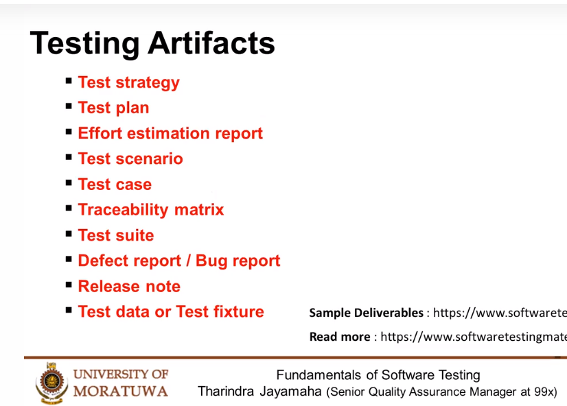
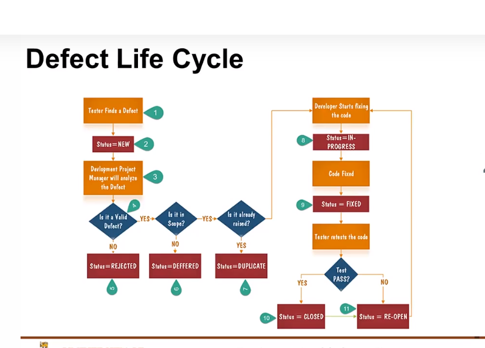

# Software Quality Assurance

## Airplane Testing

## Software Testing

# QA Engineer is NOT a Tester!

## Tasks of QA Engineer

## QA Tracks

# IEEE Definition

## Non Functional Testing

## Testing Artifacts

# Defect Life Cycle

